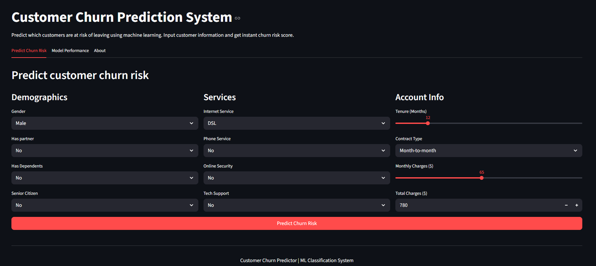
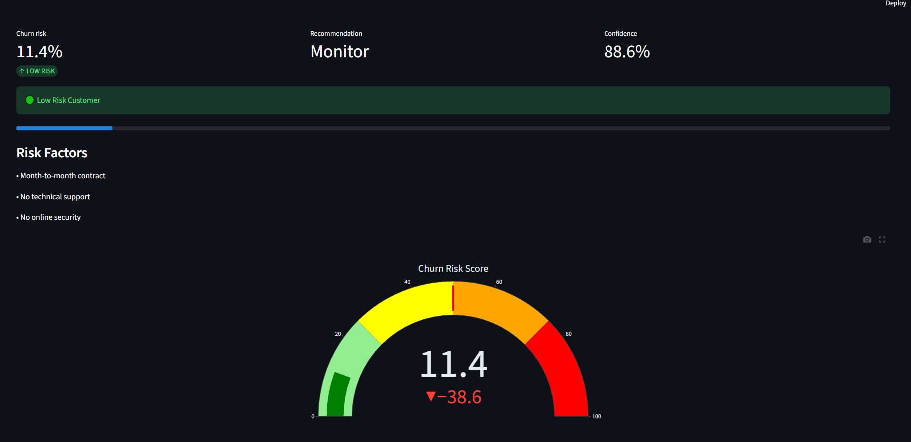

# Customer Churn Prediction

This project predicts customer churn for a telecommunications company using Machine Learning

The goal is to identify customers at risk of leaving the service, allowing companies to take proactive retention actions.

The project covers the complete Machine Learning workflow:

- Exploratory Data Analysis (EDA)
- Data Cleaning and Preprocessing
- Feature Engineering
- Model Training and Evaluation
- Model Selection
- Deployment with Streamlit

[](https://www.python.org/downloads/)
[](https://opensource.org/licenses/MIT)

**Try it now:** [Customer Churn Prediction](https://customer-churn-prediction-ita7aw9yczkojvrs9bxqke.streamlit.app)

---

## Dataset
Dataset: Telco Customer Churn Dataset

The dataset contains customer information such as:

- Demographics
- Service subscriptions
- Contract information
- Billing information
- Churn status

**Target Variable:**
```text
Churn
0 = Customer stays
1 = Customer leaves
```

**Dataset Size**
```text
Rows: 7,043
Features after engineering: 28
Target: Churn
```

---

## Project Workflow
1. **Exploratory Data Analysis**
Performed data exploration to:
- Understand churn distribution
- Identify important variables
- Detect missing values
- Analyze customer behavior patterns

**Examples:**
- Churn by tenure
- Churn by contract type
- Monthly charges analysis

2. **Data Preprocessing**
**Steps performed:**
- Converted target variable to binary
- Removed customer ID
- Handled missing values
- Encoded categorical variables
- Created additional predictive features

The model uses 28 engineered features including:

### Customer Information
- gender
- SeniorCitizen
- Partner
- Dependents

### Account Information
- tenure
- MonthlyCharges
- TotalCharges
- Contract type

### Services
- InternetService
- PhoneService
- OnlineSecurity
- OnlineBackup
- DeviceProtection
- TechSupport
- StreamingTV
- StreamingMovies

### Engineered Features
- high_charges_ratio
- high_total_charges
- tenure_group

3. **Model Training**
Three classification models were evaluated:

| Model | Purpose |
|-------|---------|
| **Logistic Regression** | Baseline model |
| **Random Forest** | Tree-based ensemble |
| **Gradient Boosting** | Boosting ensemble |

**Data split:**
```text
Train: 80%
test: 20%
```
Stratified sampling was used to preserve churn distribution

4. **Model Evaluation**
**Evaluation metrics:**
- Accuracy
- Precision
- Recall
- F1 Score
- ROC-AUC

**Results:**
| Model | Accuracy | Precision | Recall | F1 | ROC-AUC |
|-------|----------|-----------|--------|----|--------|
| **Logistic Regression** | 0.805 | 0.667 | 0.529 | 0.590 | 0.845 |
| **Random Forest** | 0.798 | 0.653 | 0.508 | 0.571 | 0.835 |
| **Gradient Boosting** | 0.798 | 0.644 | 0.532 | 0.583 | 0.836 |

## Model Performance Summary
The Logistic Regression model achieved the best overall performance:

- Accuracy: 80.5%
- Precision: 66.7%
- Recall: 52.9%
- F1-Score: 59.0%
- ROC-AUC: 0.845

The model provides good ranking capability while maintaining interpretability,
making it suitable for customer retention analysis.

---

## Key Findings
**Important factors associated with churn**
- Short customer tenure
- Month-to-month contracts
- Fiber optic internet service
- Lack of technical support
- Lack of online security

**Protective factors:**
- Long-term contracts
- Long customer tenure
- Technical support services

---

## Streamlit Application
The trained model was deployed using Streamlit

**Features**
- interactive customer input form
- Real-time churn prediction
- Churn probability score
- Risk level visualization
- Prediction explanations
- Model performance dashboard

## Screenshots
**Prediction Dashboard**


**Prediction Example**


---

## Project Structure

```
customer-churn-prediction/
│
├── app/
│   └── streamlit_app.py
│
├── data/
│   ├── raw/
│   ├── processed/
│   └── models/
│
├── notebooks/
│   ├── 01_eda.ipynb
│   ├── 02_preprocessing.ipynb
│   ├── 03_training.ipynb
│   └── 04_evaluation.ipynb
│
├── docs/
│   └── images/
│
├── requirements.txt
├── README.md
└── .gitignore
```

---

## Tech Stack

### Data Processing
- Pandas
- NumPy

### Machine Learning
- Scikit-Learn

### Visualization
- Matplotlib
- Seaborn
- Plotly

### Deployment
- Streamlit

### Model Serialization
- Joblib

---

## How to Run
1. **Clone repository:**
```bash
git clone https://github.com/PraetorClaudius/customer-churn-prediction.git
```

2. **Install dependencies:**
```bash
pip install -r requirements.txt
```

3. **Run Streamlit application:**
```bash
streamlit run app/streamlit_app.py
```

---

## Future Improvements
- SHAP explainability
- Hyperparameter tuning
- Cross-validation pipeline
- Cloud deployment
- Customer retention recommendations

## Author

**Eduardo Arriaga Alejandre**
Portfolio Project

- 🔗 [LinkedIn](https://www.linkedin.com/in/eduardo-arriaga-230156295/)
- 💻 [GitHub](https://github.com/PraetorClaudius)
- 📧 [Email](earriaga0226@gmail.com)
